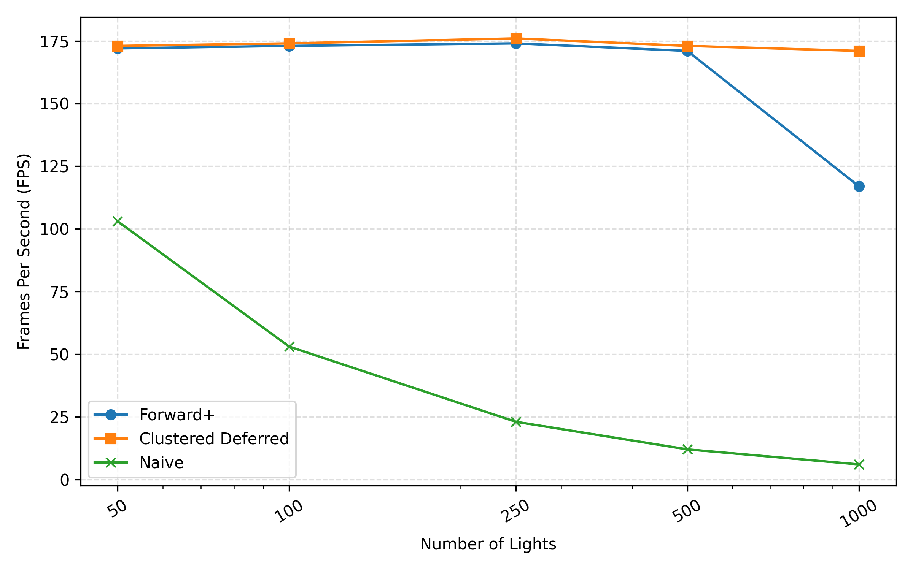
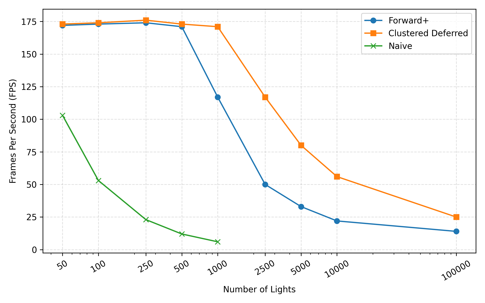
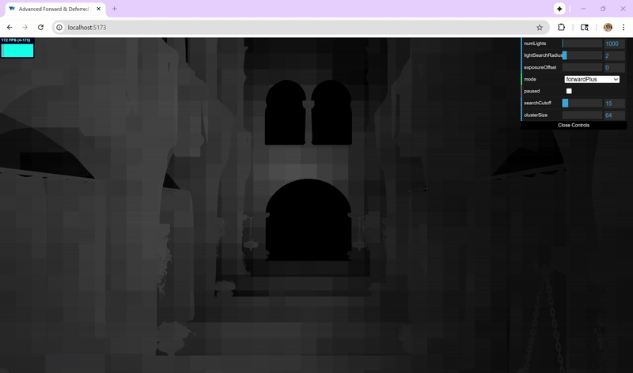
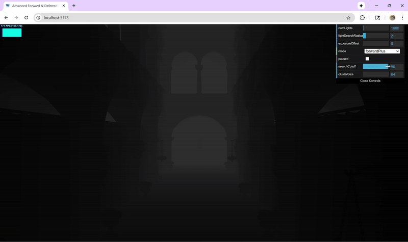
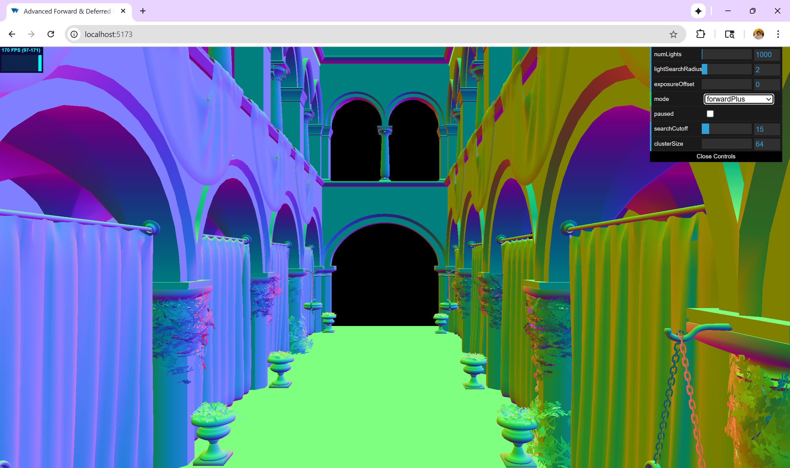
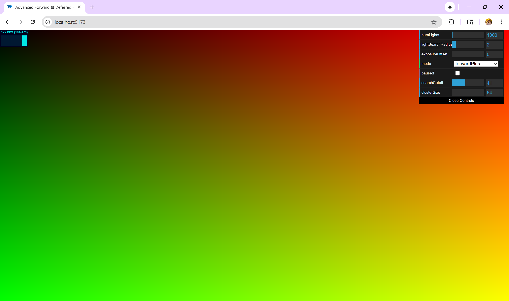

# Forward+ and Clustered Deferred Shading in WebGPU

> [Full-size MP4 Here](img/preview.mp4)

> [Full-size MP4 Here](img/walkthrough.mp4)

## [Live Deployment on my Personal Portfolio Domain Here](https://advanced-forward-deferred.webgpu.amyliu.dev/)

*NOTE: if your browser does not support WebGPU, my project will unfortunately either not load, or load but behave unpredictably.*

*Check [here](https://github.com/gpuweb/gpuweb/wiki/Implementation-Status) for the implementation status of your browser.*

## Overview
This project implements three different rendering techniques in WebGPU and WGSL (WebGPU Shading Language):
- Naive Forward Rendering
- Forward+ Rendering
- Clustered Deferred Rendering

## Achievement
**The `Clustered Deferred Renderer` and `Forward+ Renderer` consistently achieve *170+ FPS* on a *3840 x 2160* monitor. More importantly, the results are cross-platform tested on Linux, Windows, and MacOS.**

## Table of Contents
- [Forward+ and Clustered Deferred Shading in WebGPU](#forward-and-clustered-deferred-shading-in-webgpu)
  - [Live Deployment on my Personal Portfolio Domain Here](#live-deployment-on-my-personal-portfolio-domain-here)
  - [Overview](#overview)
  - [Achievement](#achievement)
  - [Table of Contents](#table-of-contents)
  - [Algorithm Overviews](#algorithm-overviews)
    - [Naive Forward Rendering](#naive-forward-rendering)
    - [Forward+ Rendering](#forward-rendering)
    - [Clustered Deferred Rendering](#clustered-deferred-rendering)
  - [Performance Analysis](#performance-analysis)
    - [Number of Lights in Scene to Performance (FPS)](#number-of-lights-in-scene-to-performance-fps)
  - [Other Optimizations and Features](#other-optimizations-and-features)
    - [Z Search Cutoff](#z-search-cutoff)
    - [Light Search Radius](#light-search-radius)
    - [Cluster Size](#cluster-size)
    - [Misc Features](#misc-features)
  - [Debugging Renders](#debugging-renders)
    - [Hash Sorting for Fragment Cluster IDs](#hash-sorting-for-fragment-cluster-ids)
    - [Number of Lights detected by Cluster](#number-of-lights-detected-by-cluster)
    - [View Space Depth and Visualizing `searchCutoff`](#view-space-depth-and-visualizing-searchcutoff)
    - [G-Buffer: Normals, Albedo, and Position](#g-buffer-normals-albedo-and-position)
  - [Credits](#credits)
  - [Fine Details](#fine-details)
    - [Developer Info](#developer-info)
    - [Tested on](#tested-on)

## Algorithm Overviews

### Naive Forward Rendering
As the name implies, the naive implementation processes the shading of each fragment by traversing through each and every light in the scene.

### Forward+ Rendering
In a parallelized compute shader (`shaders/clustering.cs.glsl`), aach tile (cluster) in screen space builds an array of light indices that overlap into its bounds. During the shading rendering pass, this allows us to only evaluate lights relevant to that fragment's local cluster, instantly reducing per-fragment computation compared to naive forward shading.

### Clustered Deferred Rendering
This algorithm follows the same cluster-to-light mapping logic as the Forward+ Rendering. However, an extra optimization is implemented using the idea of G-buffers.

The G-buffer pass stores per-pixel `position`, `normal`, and `albedo` as `texture2d` objects. Then, we queue a full-screen lighting stage using the Forward+ clustering logic, but sampling directly from the stored buffers. This effectively decouples geometry processing from shading.

## Performance Analysis

A few performance tests were conducted to compare the runtime performance and scalability of the **Forward+** and **Clustered Deferred** renderers under varying uniform variable settings.

The following graph analyzes how the three methods perform under stress in the form of increaseing number of lights in the scene. As lights are proportional to the amount of searching that has to be done within the shading pipeline, there is expected to be drops in performance. However, note how up to 1000 lights in the classic `Sponza` scene, the Clustered Deferred Renderer achieves **no** performance decay.

These are the same data points but for fun, FPS was measured up until 100,000 lights within the scene. **Notably**, 25fps for the Clustered Deferred renderer is still quite optimal.

The exact FPS values are plotted below for ease-of-reference.

### Number of Lights in Scene to Performance (FPS)
| # Lights | Naive (FPS) | Forward+ (FPS) | Clustered Deferred (FPS) |
| :------: | :---------: | :------------: | :----------------------: |
|    50    |     103     |       172      |            173           |
|    100   |      53     |       173      |            174           |
|    250   |      23     |       174      |            176           |
|    500   |      12     |       171      |            173           |
|   1,000  |      6      |       117      |            171           |
|   2,500  | 3 (GPUError) |       50       |            117           |
|   5,000  |      —      |       33       |            80            |
|  10,000  |      —      |       22       |            56            |
|  100,000 |      —      |       14       |            25            |

## Other Optimizations and Features

### Z Search Cutoff

**Description:**  
I defined a `searchCutoff` for the maximum z distance at which a light can affect a cluster. Beyond this threshold, lights are ignored during cluster-light mapping, reducing unnecessary light checks for distant clusters.

The following measurements were taken for the Clustered Deferred renderer, with other parameters (elaborated below) kept constant at default values. Notably, `numLights` is kept at 5000, and `lightSearchRadius` at 2.0.

| Cutoff  | FPS |
|:--------------:|:---:|
| 5              | 175 |
| 10             | 171 |
| 15             | 161 |
| 20             | 134 |
| 25             | 127 |
| 30             | 125 |
| 40             | 135 |
| 50             | 140 |
| 100            | 147 |

Interestingly, the performance drop from larger radius reached a min at 30 and actually increased after.

---

### Light Search Radius

**Description:**  
The `lightSearchRadius` controls how far (in cluster units) each cluster looks for nearby lights to include in its local light list. A smaller radius limits light overlap checks and improves performance, while a larger radius ensures full light coverage at higher cost.

The following results were measured using the Clustered Deferred renderer with a fixed `searchCutoffRadius` of 15 and `numLights = 2500`.

| Search Radius | FPS |
|:--------------:|:---:|
| 1              | 174 |
| 2              | 135 |
| 3              | 99  |
| 4              | 94  |
| 5              | 95  |
| 6              | 96  |
| 7              | 95  |
| 8              | 96  |
| 9              | 99  |
| 10             | 105 |

Performance drops sharply between radii 2–4 due to the increased number of nearby light checks. Beyond that, the frame rate again stabilizes as additional lights contribute minimally to shading.

---

### Cluster Size

**Description:**  
*Cluster size* defines how many pixels are grouped into each cluster in screen space. Smaller clusters improve precision but increase clustering overhead, while larger clusters reduce computation at the cost of lighting accuracy.

**Control Parameters:**  
canvasSize = 1986 × 1365  \
`numLights` = 2500  \
`lightSearchRadius` = 2.0 \
`searchCutoff` = 15  

| Cluster Size (px/cluster) | Deferred (FPS) | Forward+ (FPS) |
|:--------------------------:|:--------------:|:---------------:|
| 64                         | 172            | 59              |
| 128                        | 171            | 77              |
| 256                        | 174           | 33              |
| 512                        | 171            | 28              |
| 1024                       | 171            | 24              |

Deferred performance remains essentially stable since cluster subdivision mainly affects the lighting pass, whereas Forward+ performance is proven to be highly sensitive to cluster size.

---

### Misc Features

I tried to expand on the GUI controls to make valuable debugging and performance optimization.

| Feature | Description |
|:---------|:-------------|
| **Logarithmic Z-Slicing** | Uses a non-linear depth distribution to allocate more slices near the camera, improving light culling accuracy for nearby geometry. |
| **Global Exposure Offset** | Adds an adjustable exposure control in the GUI for visual debugging and lighting balance. |
| **Renderer Pause** | Pauses light movement and updates, allowing stable inspection of lighting and cluster assignments. |

---

## Debugging Renders

I used a myriad of visual debugging techniques to ensure my renderers were implemented as expected. These were done within the Fragment Shading pass, yet there was ample opportunity for cluster debugging as well. Here are some notable mentions:

### Hash Sorting for Fragment Cluster IDs

### Number of Lights detected by Cluster

### View Space Depth and Visualizing `searchCutoff`

*note I am changing the GUI control on the top right*

### G-Buffer: Normals, Albedo, and Position

## Credits
- [Vite](https://vitejs.dev/)
- [loaders.gl](https://loaders.gl/)
- [dat.GUI](https://github.com/dataarts/dat.gui)
- [stats.js](https://github.com/mrdoob/stats.js)
- [wgpu-matrix](https://github.com/greggman/wgpu-matrix)

## Fine Details
### Developer Info
Amy Liu -- [Personal Website](https://amyliu.dev), [LinkedIn](https://linkedin.com/in/miyalana), [Github](https://github.com/mialana).

### Tested on
- Browser Provider: Google Chromium
- Desktops:
  -  Fedora 42 KDE Plasma, Wayland Protocol, Optimus GPU (Intel(R) Core(TM) Ultra 9 275HX 32GiB, NVIDIA GeForce RTX 5070Ti 12227MiB)
  -  Windows 22, Optimus GPU (Intel(R) Core(TM) Ultra 9 275HX 32GiB, NVIDIA GeForce RTX 5070Ti 12227MiB)
  -  Mac M1 2020, macOS Sequoia 15, Metal Graphics and Compute API